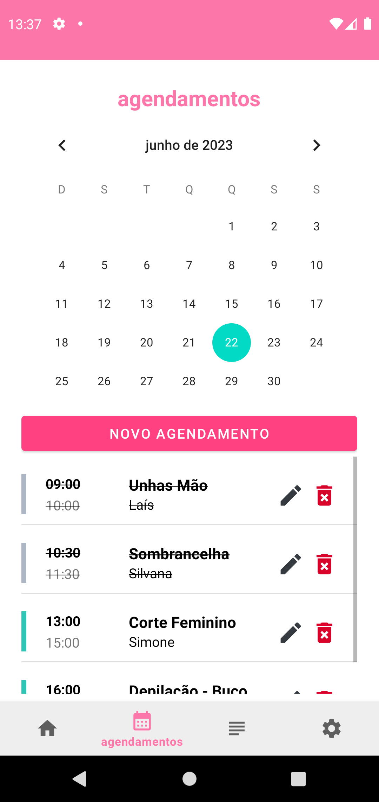
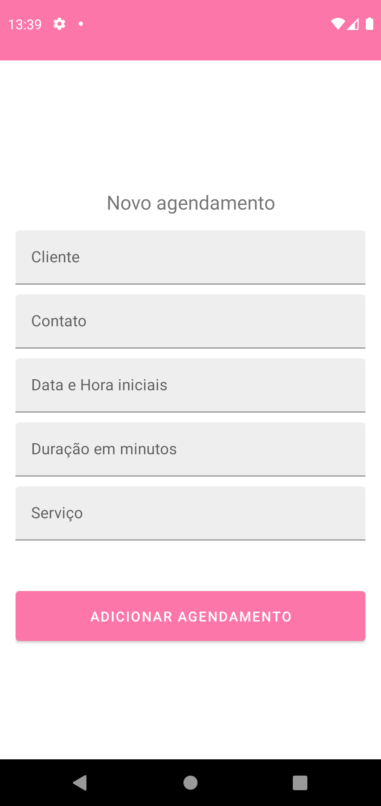
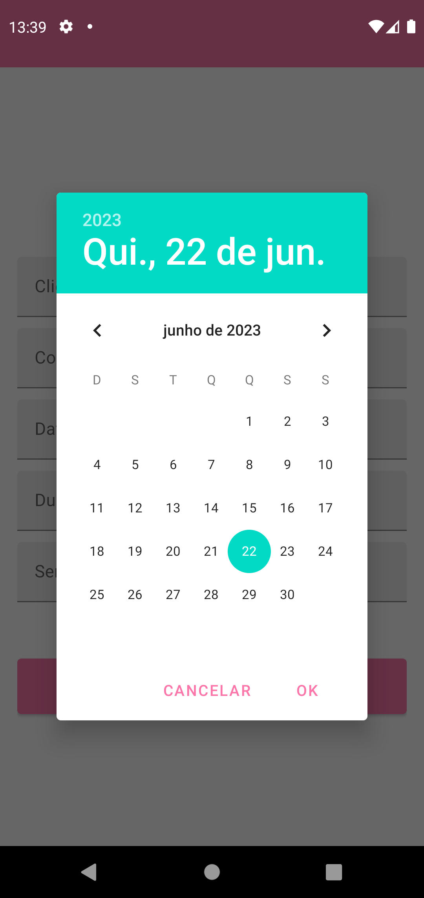
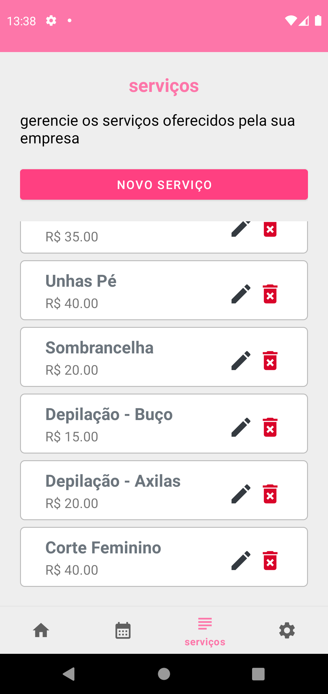
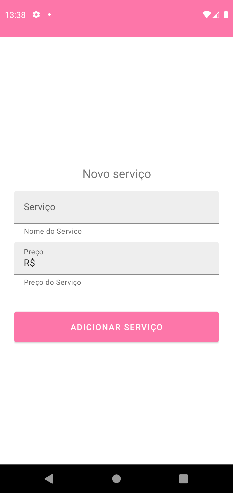

# embeauty

## Descrição:
Aplicativo Android Nativo para Gestão de Salões de Beleza. 

## Principais Features - MVP:
- [X] Login, cadastro e autenticação do usuário com Firebase
<h1>
  
  
</h1>

- [X] Tela Home: lista os agendamentos do dia, indicando qual agendamento já passou do horário e qual ainda está para acontecer
<h1>
  
</h1>

- [X] Agendamentos de serviços: data, hora, tipo do serviço, nome e telefone do cliente
<h1>
  
  
  
</h1>

- [X] Listagem de serviços que o salão oferece, com nome e preço
<h1>
  
  
</h1>

- [ ] Tela de 'Settings': opções gerais da conta
<h1>
  
</h1>

## Features Futuras:
- [ ] Features de gestão financeira: lucro diário, mensal, balanços, etc
- [ ] Features de venda de produtos: cadastro de produtos de beleza e estética, com entradas e saídas, valores, etc

## 

